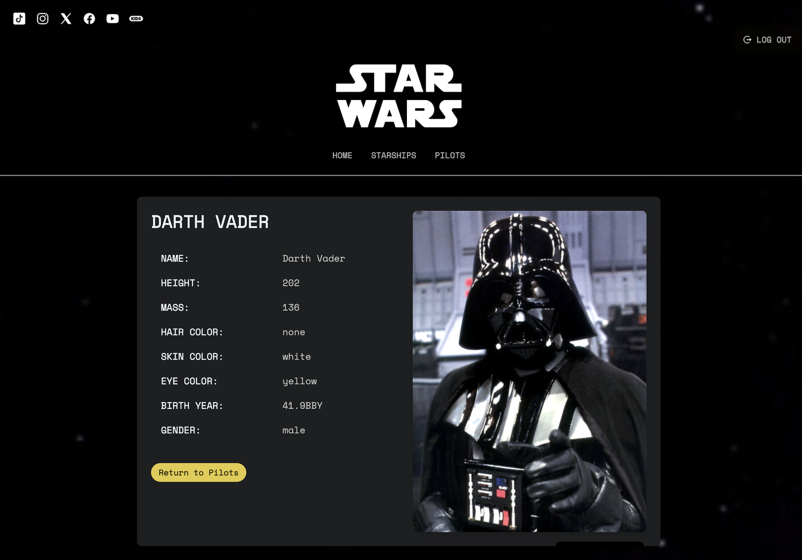
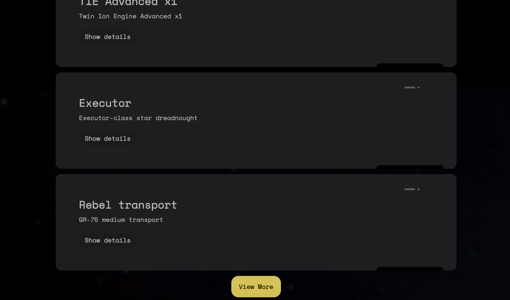

# React Star Wars Web

<div align="center"></div> 
<br>

The project consists of developing a web application to visualize information about the Star Wars spacecraft, using React and various associated technologies like axios, react-router-dom, among others which will be specified later. The goal is to create an interface that allows users to browse a list of ships, view individual details, and manage access via authentication.

<br>

## Table of Contents

1. [Project Overview](#project-overview)
2. [Technologies](#technologies)
3. [Installation](#installation)
4. [Main Features](#main-features)
5. [Star Wars API (SWAPI)](#star-wars-api-swapi)
6. [Img project gallery](#img-project-gallery)
7. [Further steps](#further-steps)
8. [Contributing](#contributing)
9. [Contact](#contact)
10. [Author](#author)

<br>

## Project Overview

<details>
  
```
dist/
node_modules/
public
├── gif/
├── screenshots/
src/
├── assets/
│   ├── fonts/
│   │   ├── Space_Mono/
│   │   └── fonts.css
│   ├── img/
│   │   ├── skeletonCrew.jpg
│   │   ├── starry-black-night.jpg
│   │   └── stars-black.jpg
│   ├── png/
│   │   ├── facebook.png
│   │   ├── instagram.png
│   │   ├── logout.png
│   │   ├── register.png
│   │   ├── user.png
│   │   └── x.png
│   └── svg/
│       ├── icons8-youtube-50.svg
│       ├── react-logo.svg
│       ├── star-wars-4.svg
│       ├── star-wars-46.svg
│       └── tiktok.svg
├── components/
│   ├── Footer/
│   │   └── Footer.jsx
│   ├── Header/
│   │   └── Header.jsx
│   ├── LoginLogout/
│   │   └── LoginLogout.jsx
│   ├── Navbar/
│   │   └── Navbar.jsx
│   ├── PilotsDetailCard/
│   │   └── PilotsDetailCard.jsx
│   ├── PilotsListCard/
│   │   ├── PilotsListCard.css
│   │   └── PilotsListCard.jsx
│   ├── SocialLinks/
│   │   └── SocialLinks.jsx
│   ├── SrarshipDetailCard/
│   │   └── StarshipDetailCard.jsx
│   └── StarshipListCard/
│       ├── StarshipListCard.css
│       └── StarshipListCard.jsx
├── context/
│   ├── AuthContext.jsx
│   ├── StarWarsContext.jsx
│   └── StarWarsProvider.jsx
├── data/
│   ├── pilotProperties.json
│   └── starshipProperties.json
├── helpers/
│   ├── findStarship.js
│   ├── getFromUrl.js
│   └── imageHelpers.js
├── hooks/
│   └── useData.jsx
├── pages/
│   ├── Home/
│   │   └── Home.jsx
│   ├── LoginPage/
│   │   ├── LoginPage.css
│   │   └── LoginPage.jsx
│   ├── PilotsDetailPage/
│   │   └── PilotsDetailPage.jsx
│   ├── PilotsPage/
│   │   └── PilotsPage.jsx
│   ├── RegisterPage/
│   │   └── RegisterPage.jsx
│   ├── StarshipDetailPage/
│   │   └── StarshipDetailPage.jsx
│   └── StarshipsPage/
│       └── StarshipsPage.jsx
├── routes/
│   ├── AppRoutes.jsx
│   └── privateRoute.jsx
└── services/
│   ├── firebase.js
│   └── swapiService.jsx
├── App.jsx
├── index.css
└── main.jsx
.eslintrc.cjs
.gitignore
index.html
package-lock.json
package.json
postcss.config.js
README.md
tailwind.config.js
vercel.config.js
vite.config.js
```
</details>
<br>

## Technologies

- **Frontend:**

  
  
  
  
  
  
  <br><br>

- **Tools and Libraries:**

  
  
  
  
  
  <br><br>

- **Backend auth service:**

  
  
<br>

## Installation

To get started with the Star Wars Web Application locally, follow these steps:

1. Clone the repository:

   ```bash
   git clone https://github.com/Luovtyrell/Star-Wars.git
   ```

2. Navigate to the project directory:

   ```bash
   cd Star-Wars
   ```

3. Install dependencies:

   ```bash
   npm install
   ```

4. Set up Firebase by creating a `.env` file in the root directory and adding your Firebase configuration. The configuration should look something like this:

   ```
   REACT_APP_FIREBASE_API_KEY=your_firebase_api_key
   REACT_APP_FIREBASE_AUTH_DOMAIN=your_firebase_auth_domain
   REACT_APP_FIREBASE_PROJECT_ID=your_firebase_project_id
   REACT_APP_FIREBASE_STORAGE_BUCKET=your_firebase_storage_bucket
   REACT_APP_FIREBASE_MESSAGING_SENDER_ID=your_firebase_messaging_sender_id
   REACT_APP_FIREBASE_APP_ID=your_firebase_app_id
   ```

5. Start the development server:

   ```bash
   npm start
   ```
<br>


## Main Features

| **Feature** | **Description** |
|-------------|-----------------|
| **Starship List** | Displayed a list of starships on the main screen, showing essential data: Name and Model of each starship. |
| **Load More** | Implemented a "view more" button to load additional starships and pilots. |
| **Starship Detail View** | Created a detailed view for each starship including their photo. Users can access details by clicking on a starship in the list. The view also shows who pilots the starship and in which films it appears including their photo. |
| **Pilot Detail View** | Created a new component to display detailed information about the pilot, including their photo, and styled it appropriately. |
| **Modern Design** | Modernized the site’s design to closely match the official Star Wars website. |
| **Welcome Page** | Implemented a welcome page with a button to access the main starship list and pilots, using React routing for navigation. |
| **User Management** | Developed a fake backend with Firebase for user management. Implemented Login and Register screens, ensuring users cannot register with the same email and are logged in immediately after registration. |
| **Route Protection** | Protected routes so that only registered users can view the starship list and pilot list. Redirected unauthenticated users to the login page and then back to the originally requested page upon successful login. |
| **Film and Pilots Appearances** | Added information on which pilots have piloted each starship and in which films the starships appeared, including photos of the pilots and film poster. |
| **Context & Provider** | Implemented Context and Provider for global state management. 
| **`useData` Hook** | A custom React hook designed for managing data fetching from APIs. It simplifies the process of retrieving data from single or multiple endpoints and handles the loading state, data, and errors. This hook uses `useEffect` to perform asynchronous data fetching and updates the state based on the API responses. It supports both single and multiple endpoint requests and ensures that the data is properly formatted and errors are handled gracefully. |
| **`fetchData` Function** | A utility function for making HTTP GET requests using Axios. It fetches data from a specified URL and includes error handling to provide user-friendly error messages if the request fails. This function sets custom headers and manages the response data, ensuring that any issues encountered during the data retrieval process are communicated effectively. |

<br>

## Star Wars API (SWAPI)

In this project, I have utilized the [Star Wars API](https://swapi.dev/) to fetch information related to starships, films, pilots and characters. Additionally, I have used the [Star Wars Visual Guide](https://starwars-visualguide.com/#/) as a server for retrieving images related to Star Wars characters, starships, films, and other elements. This server provides image resources that complement the data retrieved from the API.

### How to Use

- **Star Wars API**: Provides structured data about Star Wars entities. See the for details on endpoints and usage: [API documentation](https://swapi.dev/documentation)
- **Star Wars Visual Guide**: Supplies image URLs for visual representation. For example, images can be accessed at `https://starwars-visualguide.com/assets/img/characters/1.jpg` for a specific character.

<br>

## Img project gallery

| Img | Description |
|--------|------------------------------|
|  | Full detail character view |
|  | Detail character view |
|  | Register page |
|  | Log in page |
|  | Full detail starship view |
|  | Detail starship view |
|  | Full responsive starship view |
|  | Home page |
|  | Starship card list |
|  | View more button |

<br>

## Further Steps

-  **Testing:** In the future, I plan to implement unit tests for individual components with vitest.

- **Display Planet List and Detailed Card:** This will involve integrating with the Star Wars API to fetch and display a list of planets, as well as providing detailed information about a specific planet, including its inhabitants and the films in which it appears.

<br>

## Contributing

Contributions to the Star Wars Web Application are welcome! To contribute:

1. Fork the repository.
2. Create a new branch (`git checkout -b feature/YourFeature`).
3. Make your changes and commit (`git commit -am 'Add new feature'`).
4. Push to the branch (`git push origin feature/YourFeature`).
5. Create a new Pull Request.
<br>


## Contact

For questions or feedback, feel free to open an issue on the GitHub repository or contact me directly at: <br> 

<a href="mailto:luciaorvilanova@gmail.com" target="_blank" rel="noreferrer"></a> <a href="https://www.linkedin.com/in/luovtyrell" target="_blank" rel="noreferrer"></a> <a href="https://t.me/luovtyrell" target="_blank" rel="noreferrer"></a> <a href="http://discordapp.com/users/664163194989707308" target="_blank" rel="noreferrer"></a>

<br>

## Author
[](https://github.com/Luovtyrell) <a href="https://www.github.com/Luovtyrell"> <br>

</a>
> May the Force be with you as you explore the Star Wars universe! 🌌


